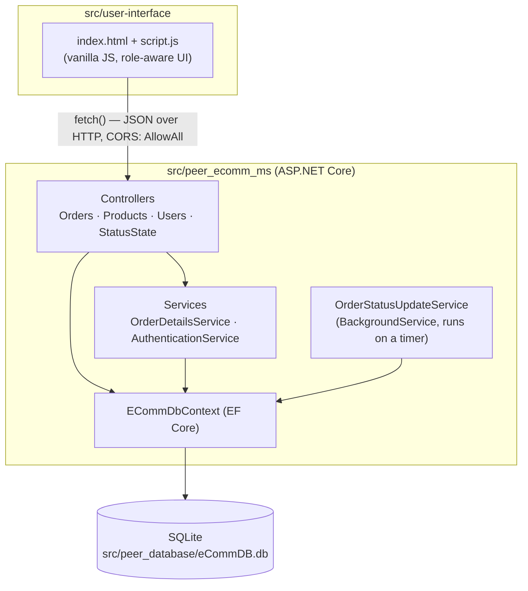
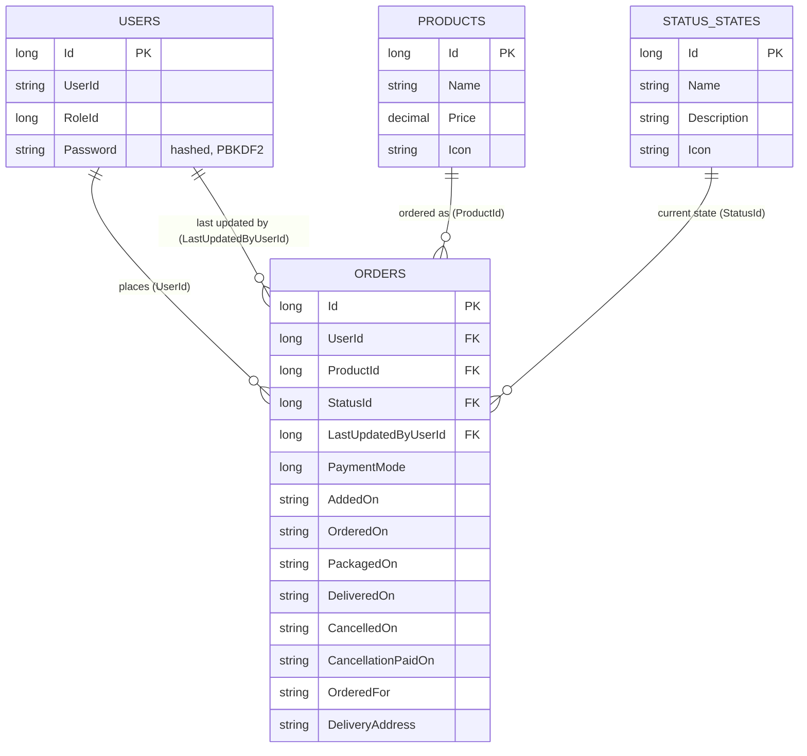
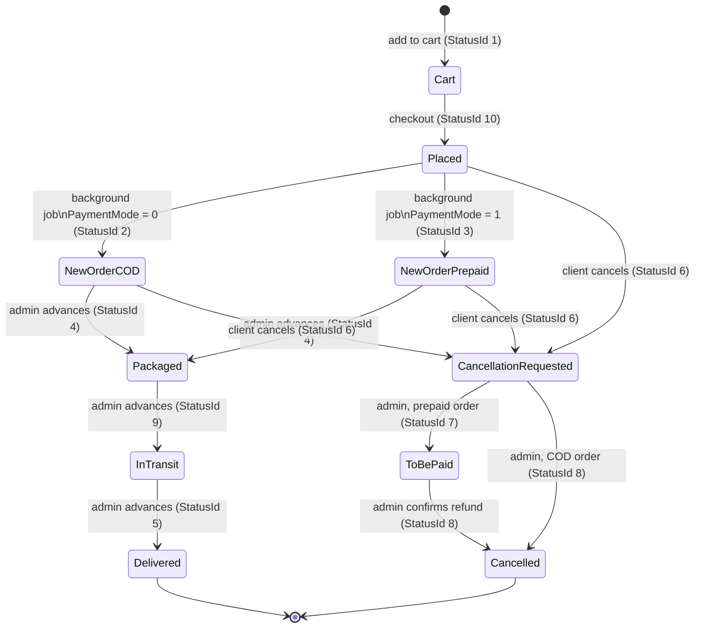
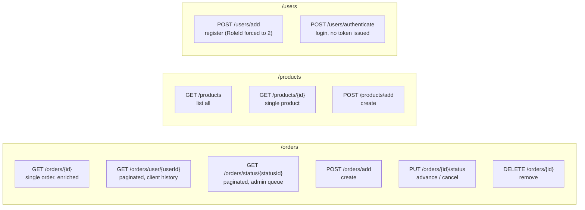
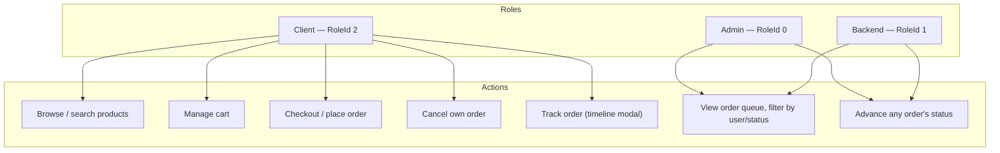
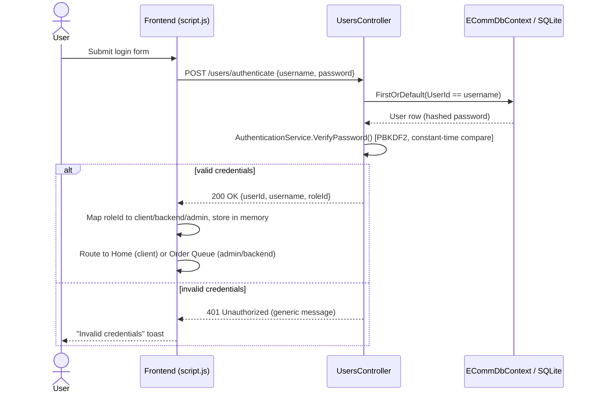
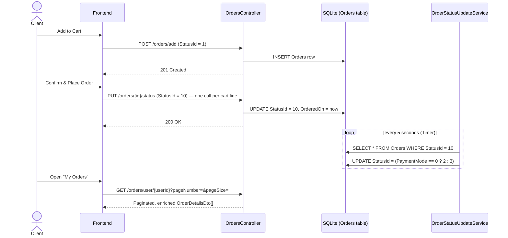

# Peer-eCommOrderProcessingSystem

E-Commerce - Order Processing System

A backend service for managing e-commerce orders: creating orders, tracking status through a fulfillment lifecycle, and auto-advancing paid/COD orders via a background job that sweeps newly-placed orders on a timer. Ships with a plain HTML/CSS/JS storefront that talks to the API directly.

## Demo Recording

Two walkthrough recordings are included in the [`Demo Recording/`](Demo%20Recording) folder (clone/download the repo to play them — they're not hosted externally):

| File | Covers |
|---|---|
| [`eCommOrderSyst-Demo Recording.mp4`](Demo%20Recording/eCommOrderSyst-Demo%20Recording.mp4) | Full end-to-end walkthrough: client login/registration, browsing products, cart, checkout (COD and online payment), order tracking timeline, and the admin/backend queue advancing an order through its full lifecycle. |
| [`Demo-TestCase.mp4`](Demo%20Recording/Demo-TestCase.mp4) | Focused test-case run — exercising specific request/response scenarios (e.g. validation errors, cancellation rules) against the API. |

## Tech Stack

- **ASP.NET Core Web API** (.NET 10 / `net10.0`)
- **Entity Framework Core** with **SQLite** for persistence
- **xUnit** for unit tests, run against EF Core's in-memory provider
- **OpenAPI / Swagger UI** for interactive API docs in development
- **Vanilla HTML / CSS / JavaScript** frontend (`src/user-interface/`) — no framework, no bundler, no build step; talks to the API over `fetch()`

## Architecture



The background job runs **inside the same process** as the API (registered via `AddHostedService`) — it is not a separate deployable today.

## Project Structure

```
src/
  peer_database/
    eCommDB.db                     # SQLite database file used at runtime
  peer_ecomm_ms/
    peer_ecomm_ms/                 # API project
      Controllers/                 # OrdersController, ProductsController, UsersController, StatusStateController
      Services/                    # OrderDetailsService, OrderStatusUpdateService (background job), AuthenticationService
      Models/                      # Orders, Products, Users, StatusStates
      Models/DTOs/                 # Response DTOs (OrderDetailsDto, ProductDetailsDto, StatusDetailsDto, UserDetailsDto)
      DBA/ECommDbContext.cs        # EF Core DbContext
      Program.cs                   # App startup / DI wiring
    peer_ecomm_ms.Tests/           # xUnit test project (Controllers + Services)
  user-interface/
    index.html                     # Single-page markup (auth, home, cart, orders views)
    css/styles.css                 # "Peer" dark marketplace theme
    scripts/script.js              # All frontend logic — auth, cart, checkout, order tracking, admin queue
```

## Prerequisites

- [.NET 10 SDK](https://dotnet.microsoft.com/download)
- SQLite database file at `src/peer_database/eCommDB.db` (already included in the repo, pre-seeded with `Products`, `Users`, and `StatusStates` reference data)
- A modern browser (no install needed) to run the frontend

## Running the API

```powershell
cd src/peer_ecomm_ms/peer_ecomm_ms
dotnet run
```

By default the API listens on:
- `http://localhost:5296`
- `https://localhost:7019` (when run with the `https` launch profile)

In development, Swagger UI is available at `/swagger`.

> **Note:** `Program.cs` currently points at an absolute SQLite path (`H:\eCommOrderProcessing\src\peer_database\eCommDB.db`). If you clone this repo to a different drive/path, update the `UseSqlite` connection string in `Program.cs` before running.

## Running the Frontend

The frontend is three static files with no build step:

```powershell
# Option 1 — open directly in a browser
start src/user-interface/index.html

# Option 2 — serve statically (avoids any file:// quirks)
npx serve src/user-interface
```

It expects the API to be reachable at `http://localhost:5296` — this is hardcoded as `API_BASE_URL` at the top of `src/user-interface/scripts/script.js`. Update that constant if the API is running elsewhere.

## Running Tests

```powershell
cd src/peer_ecomm_ms/peer_ecomm_ms.Tests
dotnet test
```

Tests use EF Core's in-memory provider (see `TestHelpers/DbContextFactory.cs`), so no database file is required to run the suite.

## Domain Model

- **Order** — `Id, UserId, ProductId, StatusId, LastUpdatedByUserId, PaymentMode`, plus lifecycle timestamps (`AddedOn`, `OrderedOn`, `PackagedOn`, `DeliveredOn`, `CancelledOn`, `CancellationPaidOn`, `LastUpdatedOn`) and `OrderedFor` / `DeliveryAddress`.
- **Product** — `Id, Name, Price, Icon`.
- **User** — `Id, UserId (username), RoleId, Password (hashed)`.
- **StatusState** — reference table of order statuses (`Id, Name, Description, Icon`), e.g. `10 = Placed`, `2 = New Order - COD`, `4 = Packaged`, `5 = Delivered`, `6 = Cancellation Requested`, `8 = Cancelled`, `9 = In Transit`.

Orders reference `Product`, `User`, and `StatusState` by ID; `GET` endpoints join across these to return an enriched `OrderDetailsDto`. **These relationships are conceptual only** — no foreign keys are declared in `ECommDbContext.OnModelCreating`, so referential integrity isn't enforced by the database.

`StatusId = 1` ("in cart") is a UI convention, not a row in `StatusStates` — adding a product to the cart writes an `Orders` row immediately, so the cart is DB-persisted rather than client-side state.

### User roles

| RoleId | Role | Self-registration | UI access |
|---|---|---|---|
| `0` | Admin | Not possible via `/users/add` | Order queue, advance any order's status |
| `1` | Backend | Not possible via `/users/add` | Same as Admin |
| `2` | Client | Default for every `/users/add` call | Storefront, cart, checkout, own order history, cancel own orders |

### Entity relationship diagram



## Order Lifecycle



**Cancellation rule:** an order can only move to status `6` (Cancellation Requested) or `8` (Cancelled) while it is still `Placed`/`New Order` (`10`, `2`, `3`) or already mid-cancellation (`6`, `7`); once it reaches `Packaged` (`4`) or later, cancellation is rejected with a 400. This is the only transition rule enforced in `OrdersController.UpdateOrderStatus` — forward progression (e.g. `Packaged → In Transit`) is not guarded by the API itself, only by which buttons the admin UI chooses to show.

## API Routes



### Orders (`/orders`)
| Method | Route | Description |
|---|---|---|
| `GET` | `/orders/{id}` | Get a single order with enriched product/status/user details. 404 if not found. |
| `GET` | `/orders/user/{userId}?pageNumber=&pageSize=` | Paginated orders for a user. |
| `GET` | `/orders/status/{statusId}?pageNumber=&pageSize=` | Paginated orders filtered by status. |
| `POST` | `/orders/add` | Create a new order. |
| `PUT` | `/orders/{id}/status` | Update an order's status (also used to cancel — see above). |
| `DELETE` | `/orders/{id}` | Delete an order. |

There is no unfiltered "list all orders" endpoint by design — orders must be queried by ID, user, or status.

### Products (`/products`)
| Method | Route | Description |
|---|---|---|
| `GET` | `/products` | List all products. |
| `GET` | `/products/{id}` | Get a single product. 404 if not found. |
| `POST` | `/products/add` | Create a product. |

### Users (`/users`)
| Method | Route | Description |
|---|---|---|
| `POST` | `/users/add` | Register a new user (hashes the password, always assigns `RoleId = 2`). |
| `POST` | `/users/authenticate` | Authenticate with username/password. |

## Roles & Access (RBAC)



> **This is a UI-only distinction, not server-side access control.** `roleId` comes back from `/users/authenticate` and is held in a JavaScript variable (`currentRole`) that decides which tabs/buttons render. No middleware checks the caller's role (or even identity) on the API side — any client that knows the routes can call `PUT /orders/{id}/status` or `/orders/status/{statusId}` directly, regardless of role. See *Known Limitations*.

## Sequence Flows

### Login and role-based routing



### Checkout and background status sweep



## Background Job

`OrderStatusUpdateService` (`Services/OrderStatusUpdateService.cs`) is a `BackgroundService` that:

1. Runs once immediately on application startup.
2. Then runs on a repeating `Timer` — **every 5 seconds** in the current code (`TimeSpan.FromSeconds(5)` for both the due-time and the period).
3. On each run, finds all orders with `StatusId == 10` (Placed) and advances them: `StatusId = 2` (New Order - COD) if `PaymentMode == 0`, otherwise `StatusId = 3` (New Order - Prepaid).
4. Wraps each run in try/catch so a failure is logged and doesn't crash the host or block the next scheduled run.

> **Note:** the original assignment spec calls for a 5-*minute* sweep; the implementation currently uses 5 *seconds*. The behavior is safe either way (each run is idempotent — a second sweep simply finds nothing left at status 10), but the interval should be revisited (`TimeSpan.FromMinutes(5)`) before this is treated as production-representative of the intended cadence.

## Known Limitations / Assumptions

- The SQLite connection string in `Program.cs` is a hardcoded absolute path rather than a configurable one (e.g. via `appsettings.json`).
- Status transitions are enforced via numeric ID checks in `OrdersController.UpdateOrderStatus` rather than a shared, named state-machine/transition table, and only the cancellation branch is actually guarded — forward progression isn't validated server-side.
- No authentication middleware guards the API — `/users/authenticate` returns a success payload but no token/session is issued or checked on subsequent requests; the `roleId`-based UI in the *Roles & Access* section above is a client-side convenience only, not enforcement.
- No foreign keys are declared in `ECommDbContext` — `Orders.UserId`/`ProductId`/`StatusId` are unconstrained at the database layer, so orphaned references are possible.
- Order writes use a plain read-modify-write with no optimistic concurrency (no version/rowversion column) — two concurrent updates to the same order (e.g. an admin advancing status while a client cancels, or the background sweep racing a manual update) can silently overwrite each other.
- The background sweep interval in code (5 seconds) doesn't match the 5-minute cadence described in the original assignment brief — see *Background Job* above.
